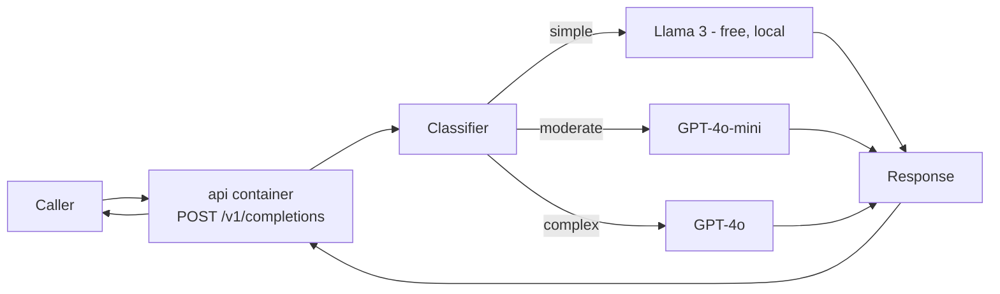
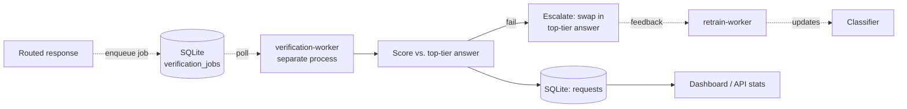

# Case study: LLM Cost Autopilot

**I built a system that reduced LLM API costs by 20.3% while maintaining
98.7% quality parity with the top-tier model.**

> Accomplished a 20.3% reduction in LLM API spend while holding 98.7%
> quality parity with GPT-4o, as measured by two independent 500-request
> live load tests against real OpenAI, Anthropic, and local Llama traffic,
> by building a complexity-based router — a 97.8%-accurate classifier
> feeding a sampled async verification loop with LLM-as-judge scoring,
> auto-escalation, and a feedback loop into classifier retraining — after
> finding and fixing a hidden defect where checking every single answer
> was itself erasing the savings it was supposed to protect.

Most teams running LLMs in production send every request — a one-line
extraction and a multi-step planning task alike — to the same frontier
model, paying frontier prices for work a fraction of it could do just as
well. This system treats model choice as a routing decision instead of a
hard-coded constant, and treats "does this actually work" as something to
measure, not assume.

## The routing logic

Every request first hits a **classifier** — scikit-learn, trained on 224
hand-labeled prompts spanning three complexity tiers (simple/moderate/
complex) — that scores it in milliseconds using cheap lexical features
(token count, instruction verbs like *analyze* vs. *extract*, constraint
count, output-format complexity). No LLM call needed to decide which LLM to
call. The predicted tier is looked up in a **router** (`routing.yaml`) that
maps it to a model: free local Llama for simple requests, GPT-4o-mini for
moderate ones, GPT-4o for complex ones. That mapping is live-editable
through `PUT /v1/routing-config` — swap models without touching code or
redeploying. The classifier's own accuracy — 97.8% held-out — is what makes
the whole routing decision trustworthy in the first place.

## The feedback loop

The router's decision isn't trusted blindly. After a response goes back to
the caller, a **separate worker process** (not a thread in the API — a
genuinely independent process, so verification never adds latency or
competes with the API for resources) re-runs a sampled subset of requests
against the top-tier model and scores agreement with a check suited to the
request type: exact match for classification, typed-field coverage for
extraction, an LLM-as-judge for summarization and everything else. A
failure gets **escalated** — the top-tier answer replaces the cheap one as
the record of what actually happened — and logged as a new training
example. A **retrain worker** periodically folds accumulated failures back
into the classifier, so routing decisions are supposed to get better from
the mistakes the system catches in itself.

That loop — verify, escalate, feed back, retrain — is also exactly what
this project's real finding came out of. See below.

Full technical detail, live-tested phase by phase, is in
[docs/](docs) (`baseline_results.md` through `completion_polling.md`) and
[ROADMAP.md](ROADMAP.md).

## The headline number, and the number under it

500 requests, sampled across all three complexity tiers, routed live
through the whole pipeline above (not simulated — real OpenAI, Anthropic,
and local Ollama calls):

Routing alone looks great: **25.7% cheaper than sending everything to
GPT-4o.** That number is real, but it's answering a narrower question than
it looks like it is — "what did the cheap/expensive model calls cost,
ignoring verification entirely?" Here's what verification actually costs:

| | what's counted | total spent | vs. $0.7668 baseline |
|---|---|---:|---:|
| Routing only | whichever model answered | $0.5698 | 25.7% saved |
| + cost of fixing wrong answers | + the 133 escalation replacements | $0.7381 | 3.7% saved |
| **+ cost of checking right answers** | **+ verification on all 336 checked requests, pass or fail** | **$0.7864** | **2.6% MORE than baseline** |

The middle row is the trap. 336 of the 500 requests got double-checked
against the top-tier model — not just the ones that turned out wrong. Only
133 of those 336 actually needed the top-tier model's answer; the other 203
passed, and the system paid the top-tier model's rate to confirm that
anyway. That's money spent with nothing to show for it: you already had a
fine answer, and paid again to be told so.

An earlier version of this report stopped at the middle row and called
**3.7% saved** the honest number — an improvement over the flattering 25.7%,
but still incomplete, because it only added back the cost of the 133
failures and never added back the verification spend on the 203 passes.
That gap is $0.217 — bigger than the entire "savings" the middle row
claimed. The corrected bottom row is what this system actually spent:
**more than the naive baseline it was built to beat.** This was caught by
asking the sharper question — "if you're calling both models on two-thirds
of traffic, how is that ever cheaper than calling just one?" — rather than
stopping once a number looked responsible enough to publish.

## Where the money actually goes

Escalations aren't evenly spread. Breaking them down by *why* the verifier
checks a request the way it does tells the real story:

| verification method | requests | escalation rate |
|---|---:|---:|
| LLM-as-judge (summarization) | 48 | 0% |
| exact match (classification) | 32 | 6% |
| field-coverage proxy* (extraction) | 38 | 24% |
| **raw token-overlap (everything else)** | **218** | **56%** |

\* *Extraction's check was reworked after this run to detect real typed
fields (dates, emails, amounts, ...) instead of comparing raw output
strings — see [docs/brief_conformance_fixes.md](docs/brief_conformance_fixes.md).
The 24% figure above is from the old text-comparison version; it wasn't
re-measured under the new one (extraction is 7.6% of traffic, not enough
to justify another full paid load test on its own).*

Three purpose-built checks work well. The fallback used for anything that
doesn't match a keyword trigger — a blunt "do the two answers share enough
words" heuristic — escalates over half the time, and it's the single
biggest use case by volume (44% of all traffic). That one weak check is
responsible for most of both numbers above: the cost gap, and — traced
through the feedback loop — a real accuracy cost too.

## The feedback loop, and what happens when you trust it blindly

Every escalation gets relabeled as a "this needed the top tier" training
example and folded back into the classifier's next retrain. That mechanism
works exactly as designed. Which is the problem: across three retrains, each
one triggered by real escalations from real runs, held-out accuracy went
**97.8% → 95.7% → 85.4%** — still above the 80% target, but a clean,
repeating trend, not noise. (Separately, a handful of near-duplicate
hand-labeled prompts — e.g. "convert 5 miles to km" / "convert 3 kg to
lbs," same skeleton, different numbers — were rewritten for more genuine
variety; that data-quality fix alone brought accuracy to 87.5%, not
evidence the feedback-loop problem went away — it hadn't been fixed yet
at that point. It has now: see "The fix" below, which clears the poisoned
feedback itself and gets back to 97.8%.) The same over-eager `general`-bucket check that
erodes cost savings is also quietly teaching the classifier the wrong
lesson every time it fires: a grocery-list-to-JSON request or a "list three
pros and cons" prompt isn't actually complex, but the verifier says it
diverged from GPT-4o's phrasing, and the feedback loop takes that as gospel.

An automated feedback loop is only as trustworthy as its judge. This one's
judge has an identified, measured blind spot, and the system faithfully
amplifies it every cycle. That's the finding worth remembering here more
than any single percentage: **a system with real automated feedback is not
automatically a system that's getting better** — you have to watch what it's
actually learning from.

## The fix, validated on another live 500-request run

Two changes, targeting the two root causes above:

1. **Stop checking every answer.** Verification now samples ~20% of
   non-top-tier requests (`VERIFICATION_SAMPLE_RATE`) instead of all of
   them — still enough to catch systematic problems, at a fraction of the
   cost of grading every answer whether or not it needed grading.
2. **Replace the bad `general`-bucket check.** It now uses the same
   LLM-as-judge mechanism `summarization` already had (proven at 0% false-
   escalation rate) instead of raw token overlap.

Nothing about the routing logic changed — same classifier, same models,
same tiers. Run again at the identical scale (500 requests, same corpus):

| | before the fix | after the fix |
|---|---:|---:|
| routing-only cost reduction | 25.7% | 26.4% |
| **true net cost reduction** | **-2.6% (a loss)** | **+20.3%** |
| escalation rate | 26.6% | 1.2% |
| `general`-bucket false-escalation rate | 56% | 9% |
| classifier held-out accuracy | 85.4% (poisoned by bad feedback) | **97.8%** (recovered) |

The classifier number needed one more step beyond the two code changes:
the training examples the old broken checker had already fed back
(`classifier/data/failure_feedback.jsonl` — real cases, like a grocery-list-
to-JSON prompt mislabeled "complex") were cleared, and the classifier
retrained from the clean hand-labeled set alone. It landed at exactly the
original Phase 2 number, which is the whole point: the same clean data
produces the same result, confirming the earlier drop really was the bad
feedback and nothing else.

Full breakdown, including what each of the two fixes contributed
separately: [docs/cost_fix_results.md](docs/cost_fix_results.md).

## What's real vs. what would come next

Everything above is measured, not projected: live-tested against real
provider APIs across *three* full-scale (500-request) runs — one that found
the problem, one that confirmed the fix, one more that confirmed the fix
again independently (20.35% vs. 20.32% net — same result, not a lucky
sample) — every claim traceable to a script anyone can re-run
(`python -m eval.load_test`, `python -m eval.report_charts`). What this
project doesn't claim: it isn't running in production, the Docker
deployment is config-validated but not container-tested end-to-end (no
daemon in this build environment) — though the underlying multi-process
architecture it depends on (a separate verification-worker process) was
verified live outside Docker — and verification sampling is currently
uniform random rather than risk-targeted (check the ones likely to be
wrong, not a random fifth of everything), a real, identified next
improvement that isn't built.

Three gaps between the brief and the build were found and closed along the
way, each caught by testing actual behavior rather than trusting that the
code looked right:
- Verification runs as a genuinely separate worker process, not an
  in-process thread pool.
- Extraction verification checks real typed fields instead of comparing
  raw output strings. See [docs/brief_conformance_fixes.md](docs/brief_conformance_fixes.md).
- Escalation now actually produces a retrievable corrected answer
  (`GET /v1/completions/{id}`) — before, "auto-escalation... return the
  better result" only ever updated internal stats; the caller who asked
  the question had no way to receive the fix. See
  [docs/completion_polling.md](docs/completion_polling.md).

## Repo

Six phases end to end: unified provider interface → complexity classifier →
async verification with auto-escalation → cost dashboard → FastAPI service
→ load test — plus a second pass that found the system losing money,
fixed it, and proved the fix twice. See [README.md](README.md) for setup
and [ROADMAP.md](ROADMAP.md) for the full phase-by-phase build log.
