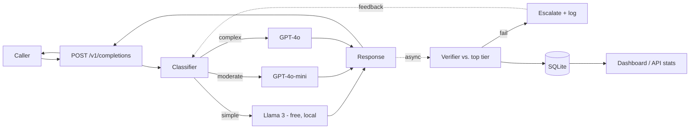

# Case study: LLM Cost Autopilot

**Routing 500 live requests through a complexity-based router cut LLM API
spend 25.7% against an all-GPT-4o baseline — but a second, harder number
matters just as much: net of what the system spent verifying its own
decisions, savings fell to 3.7%. Finding that gap, tracing it to its exact
cause, and quantifying it precisely is the actual result of this project,
not the flattering number alone.**

## The idea

Most teams running LLMs in production send every request — a one-line
extraction and a multi-step planning task alike — to the same frontier
model. That's simple, but it's also paying frontier prices for work a
$0.15-per-million-token model could do just as well. LLM Cost Autopilot
treats model choice as a routing decision: classify each request's
complexity, send it to the cheapest model that can actually handle it, and
continuously check that the cheap model's answer was good enough — with a
mechanism to catch and fix it when it wasn't.

## The system

- **Classifier** (scikit-learn, trained on 224 hand-labeled prompts across
  three complexity tiers) scores every request in milliseconds using cheap
  lexical features — no LLM call needed to decide which LLM to call.
- **Router** maps tier → model via a YAML file, live-editable through
  `PUT /v1/routing-config` — no redeploy to change the policy.
- **Verifier** re-runs the same prompt against the top-tier model
  *after* the cheap response has already gone back to the caller, scores
  agreement with a check suited to the request type, and escalates
  (substitutes the top-tier answer) on failure — all on a background
  thread, so verification never adds latency to the response.
- **Feedback loop** turns every escalation into a new training example and
  retrains the classifier on accumulated failures.
- **Dashboard and API** (`GET /v1/stats`, Streamlit) read the same logged
  data through one shared aggregation, so they can't quote different numbers
  for the same thing.

Full technical detail, live-tested phase by phase, is in
[docs/](docs) (`baseline_results.md` through `phase6_notes.md`) and
[ROADMAP.md](ROADMAP.md).

## The headline number, and the number under it

500 requests, sampled across all three complexity tiers, routed live
through the whole pipeline above (not simulated — real OpenAI, Anthropic,
and local Ollama calls):

Routing alone looks great: **25.7% cheaper than sending everything to
GPT-4o.** But 26.6% of requests (133/500) failed the quality check and got
escalated — meaning the system paid for *both* the cheap answer and the
top-tier one on more than a quarter of all traffic. Once that escalation
cost is counted as what it is — real money this system spent — net savings
drop to **3.7%**. That number showed up twice, independently: once on an
earlier 45-request sample (3.74%) and again here at 500 requests (3.74%,
to two decimal places). That's not sampling noise; it's a real, stable
property of this system as built.

## Where the money actually goes

Escalations aren't evenly spread. Breaking them down by *why* the verifier
checks a request the way it does tells the real story:

| verification method | requests | escalation rate |
|---|---:|---:|
| LLM-as-judge (summarization) | 48 | 0% |
| exact match (classification) | 32 | 6% |
| field-coverage proxy (extraction) | 38 | 24% |
| **raw token-overlap (everything else)** | **218** | **56%** |

Three purpose-built checks work well. The fallback used for anything that
doesn't match a keyword trigger — a blunt "do the two answers share enough
words" heuristic — escalates over half the time, and it's the single
biggest use case by volume (44% of all traffic). That one weak check is
responsible for most of both numbers above: the cost gap, and — traced
through the feedback loop — a real accuracy cost too.

## The feedback loop, and what happens when you trust it blindly

Every escalation gets relabeled as a "this needed the top tier" training
example and folded back into the classifier's next retrain. That mechanism
works exactly as designed. Which is the problem: across three retrains, each
one triggered by real escalations from real runs, held-out accuracy went
**97.8% → 95.7% → 85.4%** — still above the 80% target, but a clean,
repeating trend, not noise. The same over-eager `general`-bucket check that
erodes cost savings is also quietly teaching the classifier the wrong
lesson every time it fires: a grocery-list-to-JSON request or a "list three
pros and cons" prompt isn't actually complex, but the verifier says it
diverged from GPT-4o's phrasing, and the feedback loop takes that as gospel.

An automated feedback loop is only as trustworthy as its judge. This one's
judge has an identified, measured blind spot, and the system faithfully
amplifies it every cycle. That's the finding worth remembering here more
than any single percentage: **a system with real automated feedback is not
automatically a system that's getting better** — you have to watch what it's
actually learning from.

## What's real vs. what would come next

Everything above is measured, not projected: 6 phases, all live-tested
against real provider APIs, every claim traceable to a script anyone can
re-run (`python -m eval.load_test`, `python -m eval.report_charts`). What
this project doesn't claim: it isn't running in production, the Docker
deployment is config-validated but not container-tested (no daemon in this
build environment), and the fix for the `general`-bucket check — a real
LLM-as-judge for it, matching what `summarization` already has, or a
human-review gate before an escalation is trusted as a training label — is
identified but not built. That's the honest next step, not a hidden gap.

## Repo

Six phases end to end: unified provider interface → complexity classifier →
async verification with auto-escalation → cost dashboard → FastAPI service
→ this load test. See [README.md](README.md) for setup and
[ROADMAP.md](ROADMAP.md) for the full phase-by-phase build log.
