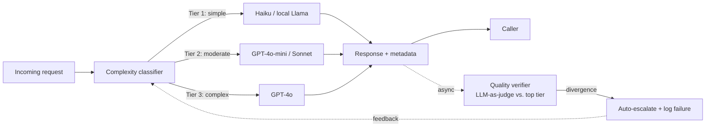

# LLM Cost Autopilot

An intelligent routing layer that sits in front of multiple LLM providers,
scores each request's complexity, routes it to the **cheapest model that can
handle it at acceptable quality**, and continuously verifies that those routing
decisions were correct.

## The problem

Teams running LLMs at scale over-provision almost every call — sending
reformatting and extraction tasks to the same frontier model they use for
multi-step reasoning. Most of that spend is waste. LLM Cost Autopilot treats
model selection as a routing decision instead of a hard-coded constant.

**Headline metric:** cost reduction vs. sending every request to the most
expensive model, measured on a fixed benchmark set while holding a quality bar.

## How it works



1. **Classifier** extracts lightweight features (token count, instruction verbs
   like *analyze* / *compare*, constraint count, whether context is supplied,
   output-format complexity) and assigns a complexity tier.
2. **Router** maps the tier to a model via a configurable YAML — swap models
   without touching code.
3. **Verifier** runs asynchronously after the response is returned: it re-runs
   the prompt against the top-tier model, scores agreement, and on significant
   divergence auto-escalates and logs a routing failure.
4. **Feedback loop** turns every routing failure into a new labeled training
   example; the classifier retrains on accumulated failures.

## Tech stack

| Component | Tool | Why |
|---|---|---|
| Language | Python 3.11+ | Ecosystem compatibility |
| Providers | OpenAI, Anthropic, Ollama | Mix of cloud and local models |
| Router / API | FastAPI | Async-native, production-grade |
| Classifier | scikit-learn (logistic regression / random forest) | Lightweight complexity scoring |
| Eval | Custom scoring + LLM-as-judge | Quality verification loop |
| Logging | SQLite + structured JSON logs | Full audit trail per request |
| Dashboard | Streamlit | Cost and quality visualization |
| Packaging | Docker + docker-compose | Multi-service orchestration |

## Repo layout

| Path | Purpose |
|---|---|
| [models.py](models.py) | `ModelConfig` dataclass + `MODEL_REGISTRY` with per-token pricing, latency, quality tier; `get_model()` / `models_by_tier()` lookups |
| [llm_clients.py](llm_clients.py) | `Response` dataclass + `send_request(prompt, model_config)` — one interface over the OpenAI, Anthropic, and Ollama SDKs, with measured latency, computed cost, env-var credentials, and retry/backoff |
| [baseline.py](baseline.py) | Runs the fixed prompt set through every model, writes `baseline_results.csv`, prints per-model cost/latency |
| [prompts/baseline_prompts.jsonl](prompts/baseline_prompts.jsonl) | 10 labelled prompts spanning the three complexity tiers |
| [classifier/tiers.py](classifier/tiers.py) | Tier constants (1/2/3) and descriptions shared by the dataset, classifier, and router |
| [classifier/features.py](classifier/features.py) | Turns a raw prompt into a fixed numeric feature vector (length, instruction verbs, constraint count, context present, output-format asks) |
| [classifier/data/build_dataset.py](classifier/data/build_dataset.py) | Writes the 224-prompt hand-labeled training set to `labeled_prompts.jsonl` |
| [classifier/train.py](classifier/train.py) | Trains logistic regression + random forest, reports accuracy/confusion matrix, saves the better one to `model.joblib` |
| [classifier/predict.py](classifier/predict.py) | Loads the trained model and scores a new prompt's tier |
| [routing.yaml](routing.yaml) + [classifier/routing.py](classifier/routing.py) | Tier → model mapping, editable without touching code |
| [eval/quality.py](eval/quality.py) | Per-use-case quality scoring: extraction field coverage, classification label match, summarization LLM-as-judge, general token-overlap fallback |
| [eval/verifier.py](eval/verifier.py) | Re-runs the routed prompt against the top-tier model on a background thread, scores agreement, auto-escalates on failure, logs every outcome |
| [eval/pipeline.py](eval/pipeline.py) | `route_and_verify(prompt)` — classify, route, call, kick off async verification; the single entry point later phases call |
| [eval/demo.py](eval/demo.py) | Runs the pipeline over the 10 baseline prompts and reports pass/fail/escalation per prompt |
| [classifier/feedback.py](classifier/feedback.py) | Harvests escalations from the verification log into `failure_feedback.jsonl`, which `classifier.train` folds into the next retrain |
| [db.py](db.py) | SQLite log of every request (hashed prompt, tier, routed model, cost, latency, quality score, escalation) — the dashboard's data source |
| [eval/seed_dashboard.py](eval/seed_dashboard.py) | Routes a tier-balanced sample of the labeled dataset through the live pipeline to populate the dashboard with real data |
| [dashboard/app.py](dashboard/app.py) | Streamlit dashboard: headline cost-reduction metric, daily cost vs. baseline, routing distribution, quality-score distribution, escalation rate over time |
| [stats.py](stats.py) | `compute_stats()` — the cost-savings summary, shared by `GET /v1/stats` and the dashboard so they can't disagree |
| [api/main.py](api/main.py) | FastAPI service: `POST /v1/completions`, `GET /v1/models`, `GET /v1/stats`, `GET`/`PUT /v1/routing-config`, `GET /health` |
| [classifier/retrain_worker.py](classifier/retrain_worker.py) | Loops: harvest routing-failure feedback, retrain if anything new came in, sleep. The second docker-compose service. |
| [Dockerfile](Dockerfile) + [docker-compose.yml](docker-compose.yml) | `api` + `retrain-worker` containers sharing state via a bind mount (SQLite isn't client-server, so there's no separate DB container) |
| [ROADMAP.md](ROADMAP.md) | Six-phase build plan and progress |

More modules (`router/`) land as the roadmap phases are built.

## Baseline (Phase 1)

Credentials are read from the environment (or a local `.env` — see
[.env.example](.env.example)):

```bash
pip install -r requirements.txt
python baseline.py            # all 10 prompts x every model
python baseline.py --limit 2  # cheap smoke run
```

Models without credentials (or a running Ollama) are skipped with a note, so a
partial run still produces data.

## Classifier (Phase 2)

```bash
python -m classifier.data.build_dataset   # (re)generate the labeled dataset
python -m classifier.train                # train + evaluate, saves model.joblib
python -m classifier.predict "some prompt"
python -m classifier.routing              # print the current tier -> model mapping
```

## Verification loop (Phase 3)

```bash
python -m eval.demo          # route + verify the 10 baseline prompts, live
python -m classifier.feedback   # harvest any escalations into training data
python -m classifier.train      # retrain, now including that feedback
```

## Dashboard (Phase 4)

```bash
python -m eval.seed_dashboard   # route a live sample into autopilot.db (default: 45 prompts)
streamlit run dashboard/app.py  # view the cost/quality dashboard
```

## API (Phase 5)

```bash
uvicorn api.main:app --reload      # local dev, http://127.0.0.1:8000/docs
docker compose up --build          # api + retrain-worker containers
```

```bash
curl -X POST localhost:8000/v1/completions -H "Content-Type: application/json" \
  -d '{"prompt": "Summarize this in one sentence: ..."}'
curl localhost:8000/v1/models
curl localhost:8000/v1/stats
curl -X PUT localhost:8000/v1/routing-config -H "Content-Type: application/json" \
  -d '{"routing": {"1": "claude-haiku-4-5"}}'
```

## Status

**Phase 1 (unified model interface) — done.** Registry, unified `send_request`,
baseline harness, and a live baseline run across all 5 models are all in place
— see [docs/baseline_results.md](docs/baseline_results.md).

**Phase 2 (complexity classifier) — done.** Tiers, feature extraction, a
224-prompt hand-labeled dataset, a trained classifier (97.8% held-out
accuracy), and `routing.yaml` are all in place.

**Phase 3 (async quality verification loop) — done.** Per-use-case quality
checks, a real background-thread verifier with auto-escalation, and a
feedback loop back into classifier training are all in place — see
[docs/phase3_notes.md](docs/phase3_notes.md) for a live demo run (2/10
escalated) and a real finding: naive feedback from that run measurably hurt
held-out accuracy (97.8% → 95.7%), which the notes dig into rather than
paper over.

**Phase 4 (logging and cost dashboard) — done.** Every request logs to
SQLite ([db.py](db.py)), and [dashboard/app.py](dashboard/app.py) visualizes
it — headline cost-reduction metric, daily cost vs. baseline, routing mix,
quality-score distribution, escalation rate. A live 45-request seed run put
routing-only savings at 30.4%, but [docs/phase4_notes.md](docs/phase4_notes.md)
shows the honest follow-through: once escalation cost is counted, net
savings drop to 3.7% — direct fallout from the same weak `general`-bucket
quality check Phase 3 flagged, now shown to be costing real money, not just
mislabeling training data.

**Phase 5 (API) — done.** [api/main.py](api/main.py) exposes the full
pipeline over HTTP; every endpoint was exercised live, including
`PUT /v1/routing-config` actually re-routing traffic without a restart.
`GET /v1/stats` and the dashboard now share one `stats.py` implementation.
Docker Compose defines the two-service deployment (`api` + a
`retrain-worker` that automates Phase 3's feedback loop, previously a manual
step) — config-validated but not run end-to-end, since this environment has
no live Docker daemon; see [docs/phase5_notes.md](docs/phase5_notes.md).
Running the retrain worker once by hand extended the trend from Phases 3-4:
accuracy is now 85.4% after three rounds of naive feedback (97.8% → 95.7% →
85.4%) — still above target, but a real, repeating cost of not fixing the
`general`-bucket quality check. See [ROADMAP.md](ROADMAP.md).
