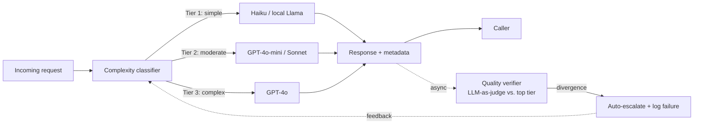

# LLM Cost Autopilot

An intelligent routing layer that sits in front of multiple LLM providers,
scores each request's complexity, routes it to the **cheapest model that can
handle it at acceptable quality**, and continuously verifies that those routing
decisions were correct.

## The problem

Teams running LLMs at scale over-provision almost every call — sending
reformatting and extraction tasks to the same frontier model they use for
multi-step reasoning. Most of that spend is waste. LLM Cost Autopilot treats
model selection as a routing decision instead of a hard-coded constant.

**Headline metric:** cost reduction vs. sending every request to the most
expensive model, measured on a fixed benchmark set while holding a quality bar.

## How it works



1. **Classifier** extracts lightweight features (token count, instruction verbs
   like *analyze* / *compare*, constraint count, whether context is supplied,
   output-format complexity) and assigns a complexity tier.
2. **Router** maps the tier to a model via a configurable YAML — swap models
   without touching code.
3. **Verifier** runs asynchronously after the response is returned: it re-runs
   the prompt against the top-tier model, scores agreement, and on significant
   divergence auto-escalates and logs a routing failure.
4. **Feedback loop** turns every routing failure into a new labeled training
   example; the classifier retrains on accumulated failures.

## Tech stack

| Component | Tool | Why |
|---|---|---|
| Language | Python 3.11+ | Ecosystem compatibility |
| Providers | OpenAI, Anthropic, Ollama | Mix of cloud and local models |
| Router / API | FastAPI | Async-native, production-grade |
| Classifier | scikit-learn (logistic regression / random forest) | Lightweight complexity scoring |
| Eval | Custom scoring + LLM-as-judge | Quality verification loop |
| Logging | SQLite + structured JSON logs | Full audit trail per request |
| Dashboard | Streamlit | Cost and quality visualization |
| Packaging | Docker + docker-compose | Multi-service orchestration |

## Repo layout

| Path | Purpose |
|---|---|
| [models.py](models.py) | `ModelConfig` dataclass + `MODEL_REGISTRY` with per-token pricing, latency, quality tier; `get_model()` / `models_by_tier()` lookups |
| [llm_clients.py](llm_clients.py) | `Response` dataclass + `send_request(prompt, model_config)` — one interface over the OpenAI, Anthropic, and Ollama SDKs, with measured latency, computed cost, env-var credentials, and retry/backoff |
| [baseline.py](baseline.py) | Runs the fixed prompt set through every model, writes `baseline_results.csv`, prints per-model cost/latency |
| [prompts/baseline_prompts.jsonl](prompts/baseline_prompts.jsonl) | 10 labelled prompts spanning the three complexity tiers |
| [classifier/tiers.py](classifier/tiers.py) | Tier constants (1/2/3) and descriptions shared by the dataset, classifier, and router |
| [classifier/features.py](classifier/features.py) | Turns a raw prompt into a fixed numeric feature vector (length, instruction verbs, constraint count, context present, output-format asks) |
| [classifier/data/build_dataset.py](classifier/data/build_dataset.py) | Writes the 224-prompt hand-labeled training set to `labeled_prompts.jsonl` |
| [classifier/train.py](classifier/train.py) | Trains logistic regression + random forest, reports accuracy/confusion matrix, saves the better one to `model.joblib` |
| [classifier/predict.py](classifier/predict.py) | Loads the trained model and scores a new prompt's tier |
| [routing.yaml](routing.yaml) + [classifier/routing.py](classifier/routing.py) | Tier → model mapping, editable without touching code |
| [ROADMAP.md](ROADMAP.md) | Six-phase build plan and progress |

More modules (`router/`, `eval/`, `api/`, `dashboard/`) land as the roadmap
phases are built.

## Baseline (Phase 1)

Credentials are read from the environment (or a local `.env` — see
[.env.example](.env.example)):

```bash
pip install -r requirements.txt
python baseline.py            # all 10 prompts x every model
python baseline.py --limit 2  # cheap smoke run
```

Models without credentials (or a running Ollama) are skipped with a note, so a
partial run still produces data.

## Classifier (Phase 2)

```bash
python -m classifier.data.build_dataset   # (re)generate the labeled dataset
python -m classifier.train                # train + evaluate, saves model.joblib
python -m classifier.predict "some prompt"
python -m classifier.routing              # print the current tier -> model mapping
```

## Status

**Phase 1 (unified model interface) — done.** Registry, unified `send_request`,
baseline harness, and a live baseline run across all 5 models are all in place
— see [docs/baseline_results.md](docs/baseline_results.md).

**Phase 2 (complexity classifier) — done.** Tiers, feature extraction, a
224-prompt hand-labeled dataset, a trained classifier (97.8% held-out
accuracy), and `routing.yaml` are all in place. The verifier, API, and
dashboard are not built yet. See [ROADMAP.md](ROADMAP.md).
